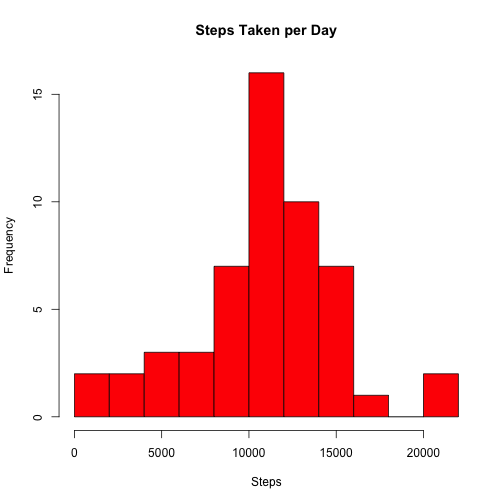
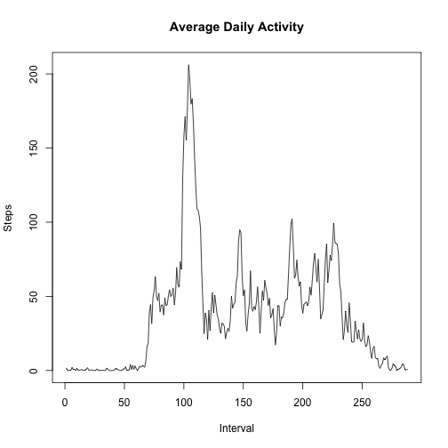
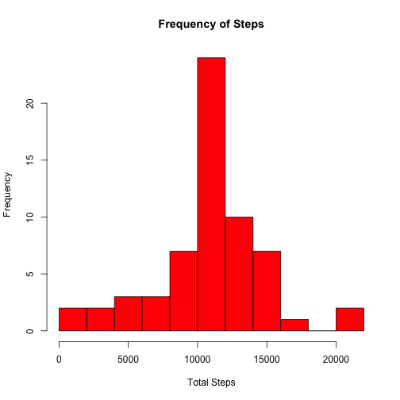
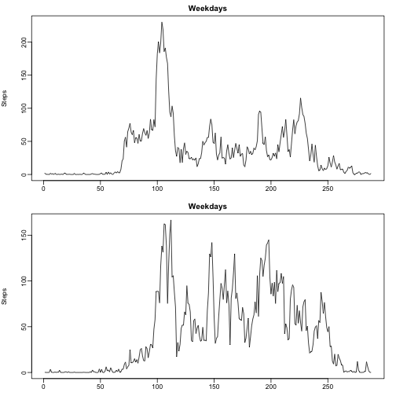

#Peer Assessment 1


##Loading and Preprocessing
We can read our data from the .csv file titled activity.csv. We are going to save two versions of the file, one version that keeps NA values and one that doesn't. For now, we use the dataframe with the NA values removed. Note we specifiy the column classes to preserve the Date formatting in the second column. 


```r
        df <- read.csv("activity.csv", stringsAsFactors = FALSE,
                       colClasses = c("numeric", "POSIXct", "numeric"))
        nadf <- na.omit(df)
        head(nadf)
```

```
##     steps       date interval
## 289     0 2012-10-02        0
## 290     0 2012-10-02        5
## 291     0 2012-10-02       10
## 292     0 2012-10-02       15
## 293     0 2012-10-02       20
## 294     0 2012-10-02       25
```


##Mean Total Number of Steps
Focusing on our dataframe without NA values, we first want to subset the data by day. With split(), we create a list of dataframes, one for each day. Then we can loop through the list to calculate the daily mean.


```r
        dailylist <- split(nadf, nadf$date)
        totald <- lapply(dailylist, function(x) sum(x[,1]))
        totald <- unlist(totald)
```

The vector named 'totald' contains the total steps taken on each day.


Let's plot a histogram of 'totald' to get an idea of how many days, each amount of steps are taken.


```r
        hist(totald, main = "Steps Taken per Day",
             xlab = "Steps", col = "red", breaks = 8)
```

 


But really, it would be useful to know what the average number of steps are on any given day.


```r
        totmean <- mean(totald)
        totmedian <- median(totald)
```

The mean daily steps taken is 1.0766189 &times; 10<sup>4</sup> and the median daily steps taken is 1.0765 &times; 10<sup>4</sup>.


##Average Daily Activity
But we know that we should not expect every 5-minute interval to have the same number of steps. It might be useful to visualize the data based on each 5-minute interval.


```r
        intlist <- split(nadf, nadf$interval)
        totali <- lapply(intlist, function(x) mean(x[,1]))
        totali <- unlist(totali)
        plot(totali, type = 'l', main = "Average Daily Activity",
             xlab = 'Interval', ylab = "Steps")
```

 

```r
        maxday <- max(totali)
                names(maxday) <- names(totali[max(totali)])
```

Interval 341 has the highest average which is 206.1698113.


##NA Values
Earlier we explored the data with the NA values removed from the data set. But doing so introduces a bias into our analysis. To avoid this, we can use alternative techniques, such as replacing NA values with that days average number of steps. Take a look at the code below; it does just that.


```r
        nas <- length(which(is.na(df[,1])))
        nadf <- df
        for (i in 1:length(nadf[,1])){
                if (is.na(nadf[i,1])){
                        nadf[i,1] <- totali[as.character(nadf[i,3])]
                }
        }
        
        nadays <- split(nadf, nadf[,2])
        totnaday <- lapply(nadays, function(x) sum(x[,1]))
        totnaday <- unlist(totnaday)
        hist(totnaday, breaks = 8, main = "Frequency of Steps", 
             xlab = "Total Steps", col = "red")
```

 

```r
        meanna <- mean(totnaday)
        medianna <- median(totnaday)
```

Without the NA values, the mean daily steps is 1.0766189 &times; 10<sup>4</sup> and the median daily steps is 1.0766189 &times; 10<sup>4</sup>. So we can see that by replacing the NA values with the average daily steps taken, we have increased the daily average by about 1,000 steps which makes sense. Also compare this histogram to the one above to see how the different means and medians effect the shape.


##Weekdays v. Weekends
Maybe the number of steps taken varies depending on if the day is a weekday or a weekend. We can use factors to explore the data in another dimension.


```r
        weekend <- c("Saturday", "Sunday")
        wday <- factor(weekdays(nadf[,2]) %in% weekend, levels =  c(F, T),
                       labels = c("weekday", "weekend"))
        
        nadf <- cbind(nadf, wday)
        wdaymeans <- aggregate(nadf[,1], list(nadf$wday, nadf$interval),
                       FUN = mean)
        par("mfrow" = c(2,1),
            "mar" = c(2.2,4,2,1.5),
            "mgp" = c(3, .5, 0),
            "cex" = .7 )
            
        plot(wdaymeans[which(wdaymeans[,1] == "weekday"),3], type = 'l',
             main = "Weekdays",ylab = "Steps", xlab = "Interval")
        plot(wdaymeans[which(wdaymeans[,1] == "weekend"),3], type = 'l',
             main = "Weekdays",ylab = "Steps", xlab = "Interval")
```

 

We can see from the plot above that the steps taken are more consistent on weekends.
        
        
